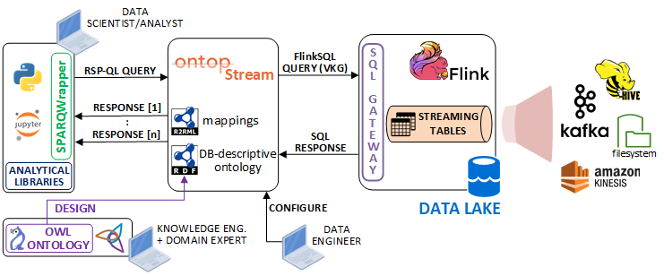

# OntopStream performance evaluation

## Considerations

This is a performance evaluation notebook to assess the OntopStream's behaviour as the data volume increases. The dockerized infrastrucure simulates an entire analytical pipeline based on the "New York Taxi dataset" of the Ververica [sql-training repository](https://github.com/ververica/sql-training). The data streams, managed in Apache Kafka, are ingested by Flink and accessed through the S-OBDA paradigm with OntopStream, in the way showed in the figure below.



The evaluation notebook includes seven RSP-QL queries to test several aspects of OntopStream, with an output limited to 200,000 RDF responses.
For each query is computed the difference between the start time, recorded before sending the HTTP request, and each result received from the OntopStream remote endpoint. The below table shows the average execution time (5 runs per query) for fetching _n-thousand_ RDF results, taken from a simulation using an AWS `t3.xlarge` machine with `4 vCPU` and `16 GB` of memory.


| Query | 1K | 10K | 50K | 100K | 150K | 200K |
| ----- | -- | --- | --- | ---- | ---- | ---- |
| __Q1__ | 2050 | 2718 | 4340 | 5996 | 7768 | 9501 |
| __Q2__ | 1685 | 2760 | 4729 | 7029 | 9326 | 11713 |
| __Q3__ | 3498 | 4281 | 7211 | 10815 | 14491 | 18043 |
| __Q4__ | 3695 | 4900 | 8491 | 13439 | 18282 | 25552 |
| __Q5__ | 3656 | 5100 | 10365 | 17738 | 25263 | 33592 |
| __Q(s,o)__ | 3368 | 4318 | 8060 | 12836 | 16719 | 20982 |
| __Q(s,p,o)__ | 5377 | 7112 | 14418 | 23188 | 31953 | 40991 |


Queries __Q1__ and __Q2__ test simple mappings involving one and two Flink dynamic tables, respectively. __Q3__ demonstrates the Ontop's stream reasoning capabilities: each `?Taxi` variable is mapped as `:Taxi`, however the reasoner is able to infer that `?Taxi` is also a `:Car` because in the ontology is stated that `:Taxi rdfs:subClassOf :Car`. __Q4__ tests the `FILTER()` query condition. Response times grow faster in __Q4__, because the pre-filtered data volume is much greater wrt. to returned response.

Moving to more complex queries, __Q5__ involves three mapped Flink dynamic tables and a more complicated VKG query translation. Thanks to the OWL2QL compliance of the Ontop internal engine, __Q(s,o)__ is able to retireve all the RDF subjects and objects given a fixed predicate, while __Q(s,p,o)__ is the full RDF materialization of the dataset under OWL2QL entailment regime.

## Tests execution

### 1. Start the producer (Kafka and Flink)

```
sudo docker-compose -f flink-kafka.yml up -d
```

### 2. Start the REST endpoint

Connectct to the `sql-client` remote terminal

```
sudo docker-compose -f flink-kafka.yml exec sql-client bash
```

Start the REST endpoint service

```
/opt/flink-sql-gateway-0.2-SNAPSHOT/bin/sql-gateway.sh --library /opt/sql-client/lib
```

__Note(1)__: keep the terminal window alive until you need the service. Close the REST service, press `CTRL+C` and type `EXIT` to leave the terminal.

__Note(2)__: the JDBC driver mappings are persisted on the local file [sql-gateway-defaults.yaml](./flink/flink-sql-gateway-0.2-SNAPSHOT/conf/sql-gateway-defaults.yaml), which is automatically loaded on startup in the `sql-client` docker image.

### 3. Start OntopStream

Open a new teminal window, then run the command:

```
sudo docker-compose -f ontop.yml up -d
```

__Note__: the DB-descriptive ontology and the Ontop mapping file are stored in the `taxiRides` folder.

### 4. Start Jupyter

```
sudo docker-compose -f jupyter.yml up
```

Load the notebook `OntopStream_preformance_evaluation.ipynb` in the jupyter environment.

Execute all the testing queries in the notebook.

### 5. Stop the demo environment

```
sudo docker-compose -f jupyter.yml down

sudo docker-compose -f ontop.yml down

sudo docker-compose -f flink-kafka.yml down
```
